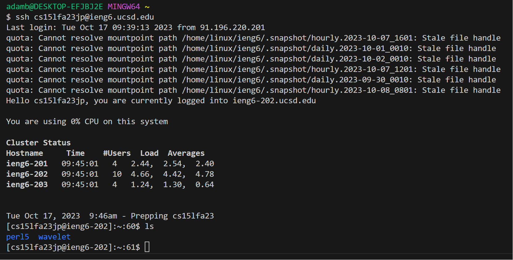

# Lab Report #2

### Part 1: Create StringServer

#### Show code for `StringServer` and two screenshots of using `/add-message`

```java
import java.io.IOException;
import java.net.URI;

class Handler implements URLHandler {
    
    String str = "";
    int num = 1;
    public String handleRequest(URI url) {
        if (url.getPath().equals("/add-message")) {
            String[] parameters = url.getQuery().split("=");
            if (parameters[0].equals("s")) {
                if (num != 1) {
                    str += "\n";
                }
                str += Integer.toString(num) + ". ";
                str += parameters[1];
                num++;
                return str;
            }
        }
        return "";
    }
}

class StringServer {
    public static void main(String[] args) throws IOException {
        if(args.length == 0){
            System.out.println("Missing port number! Try any number between 1024 to 49151");
            return;
        }

        int port = Integer.parseInt(args[0]);
        Server.start(port, new Handler());
    }
}
```

##### Screenshot #1


- Which methods in your code are called?
  - Before handling the requests, the start-up methods are called when we start the server such as 
    StringServer's `main`, the Server.start(), etc.
  - The server context is set to handle all requests. When a user requests `/add-message`, handleRequest is called
    with the url path argument set to `/add-message?s=Hello`
- What are the relevant arguments to those methods, and the values of any relevant fields of the class?
  - The first time we call `/add-message` we pass the url argument which is equal to the url path after the domain. The 
    static variables are their initial value which is `str = ""` 
    and `num = 1`.
- How do the values of any relevant fields of the class change from this specific request? If no values got changed,
  explain why.
  - We append to the static string a newline if it's not the first row, then the number of the entry, then the 
    string passed as the query parameter. Then we increment the row counter number. The result is `str = 1. Hello` 
    and `num = 2`.

##### Screenshot #2


- Which methods in your code are called?
  - When a user requests `/add-message`, handleRequest is called
    with the url path argument set to `/add-message?s=How%20are%20you`
- What are the relevant arguments to those methods, and the values of any relevant fields of the class?
  - The second time we call `/add-message` we pass the url argument which is equal to the url path after the domain. The
    static variables are their updated values of `num = 2` and `str = 1. Hello`.
- How do the values of any relevant fields of the class change from this specific request? If no values got changed,
  explain why.
  - We append to the static string a newline if it's not the first row, then the number of the entry, then the
    string passed as the query parameter. Then we increment the row counter number. The result is `str = 1. Hello\n2.
    How are you`
    and `num = 3`.

### Part 2

#### Private key on local computer:


#### Public key on server:


#### Screenshot of logging in with RSA key:



### Part 3: Describe something you learned from lab in week 2 or 3 that you didn't know before.

I learned about the man command, I've never used it before and it seems really useful just like looking it up 
without leaving the terminal. I've also learned that the mkdir command can create multiple directories. I learned 
about the pipe buffer in Linux machines, after looking up how exactly the cat command works. I've worked on embedded 
systems where I wrote something that copied one byte at a time rather than using a buffer and using a buffer is way 
faster, better, and more efficient.