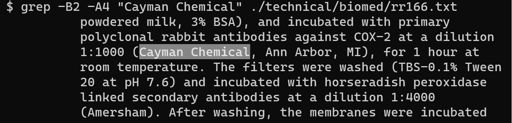

# Lab Report #3

## Part 1 - Bugs (FileExample.java Bug)

- Failure inducting input for this function is any test that runs getFiles with directories inside the main directory and also any test that doesn't expect directories to be listed along with the files. The getFiles function doesn't recursively list all files deeper than one sub-directory. Original code and test: 
```java
static List<File> getFiles(File start) throws IOException {
  File f = start;
  List<File> result = new ArrayList<>();
  result.add(start);
  if(f.isDirectory()) {
    File[] paths = f.listFiles();
    for(File subFile: paths) {
      result.add(subFile);
    }
  }
  return result;
}
```
```java
@Test
public void testFiles() {
    File f = new File("some-files");
    List<File> files = new ArrayList<File>();
    try {
        files = FileExample.getFiles(f);
    } catch (Exception e) {
    }
    String[] fileList = {
        "some-files\\a.txt",
        "some-files\\even-more-files\\a.txt",
        "some-files\\even-more-files\\d.java",
        "some-files\\more-files\\b.txt",
        "some-files\\more-files\\c.java",
    };
    String[] names = new String[files.size()];
    for (int i = 0; i < files.size(); i++) {
        names[i] = files.get(i).getPath();
    }
    assertEquals(fileList, names);
    }
}
```
- An input that doesn't induct the failure may be a test where we don't verify it can recursively list files deeper than one sub-directory and we also expect directories to be erroneously returned as well:
```java
  @Test
  public void testFiles() {
    File f = new File("some-files");
    List<File> files = new ArrayList<File>();
    try {
      files = FileExample.getFiles(f);
    } catch (Exception e) {}
    String[] fileList = {
      "some-files",
      "some-files\\a.txt",
      "some-files\\even-more-files",
      "some-files\\more-files",
    };
    String[] names = new String[files.size()];
    for (int i = 0; i < files.size(); i++) {
      names[i] = files.get(i).getPath();
    }
    assertEquals(fileList, names);
  }
```

- Symptom as output of running JUnit:

Failure inducing input:


Test that doesn't check for correct values:


- Bug before:
```java
static List<File> getFiles(File start) throws IOException {
  File f = start;
  List<File> result = new ArrayList<>();
  result.add(start);
  if(f.isDirectory()) {
    File[] paths = f.listFiles();
    for(File subFile: paths) {
      result.add(subFile);
    }
  }
  return result;
}
```

- No bugs after :sunglasses:
```java
static List<File> getFiles(File start) throws IOException {
  File f = start;
  List<File> result = new ArrayList<>();

  // if only one file, return that file
  if (!f.isDirectory()) {
    result.add(start);
    return result;
  }

  // if directory, call recursively until we get all the files
  File[] paths = f.listFiles();
  for (File subFile : paths) {
    result.addAll(getFiles(subFile));
  }

  return result;
}
```
This code fixes the issue because now it excludes listing directories and also instead recursively searches for files inside each sub-directory.

## Part 2 - Researching Commands (grep)

1. Recursive Search in Directory: `grep -r` (source: man page)

Directory:

Recursive search through a directory for any lines that match.

Singular file: (same as without -r)

Recursively search for matches given only this one file, so it does the same thing as if you gave it just the file.

2. Case Insensitive: `grep -i` (source: man page)

Directory:

Case insensitive directory search for a match. Returns all lines that contain the same word, regardless of capitalization.

File:

Matched a line, but it could have been matched with any capitalization form of antibodies like: "Antibodies" or "AnTiBoDiEs", etc.

3. List only File Names: `grep -l` (source: man page)

Directory:

Lists file names in the directory that contain a match.

File: (not an error)

Lists only this file, because out of a list of files containing only this file, this file had a match, and therefore the name of the file is returned.

4. Surrounding Search: `grep -B 3 -A 2 'Invalid user' /var/log/auth.log` [source](https://www.loggly.com/ultimate-guide/analyzing-linux-logs)

Directory:

For each match, we can see two lines before and 4 lines after from each file.

File:

We can see two lines before the found words and 4 lines after the matched words.