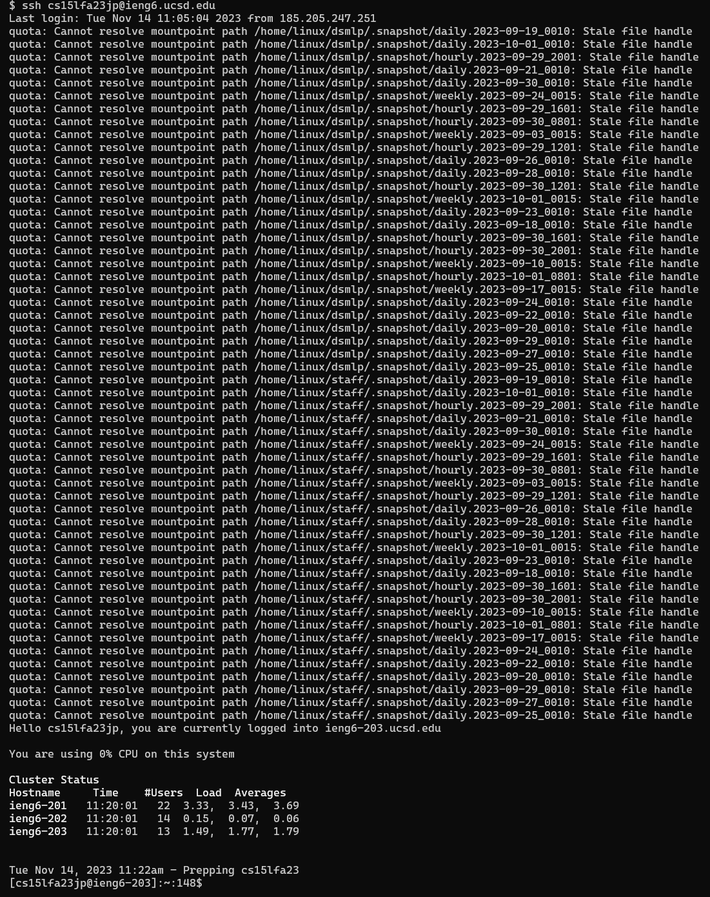
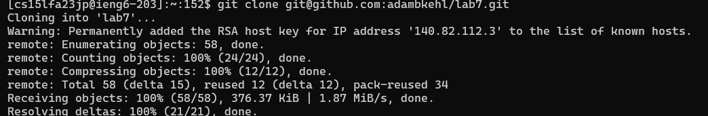
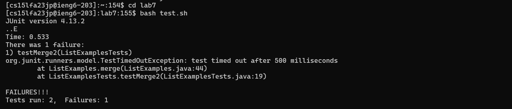
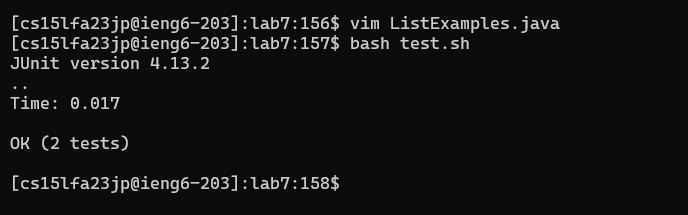
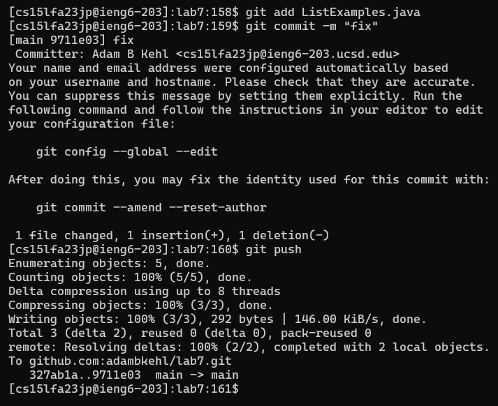

# Lab Report #4

### SSH into ieng6
- `ssh cs15lfa23jp@ieng6.ucsd.edu<enter>` to access secure shell of ieng6 server

### Git Clone
- `rm -rf lab7<enter>` to remove the old lab7 directory
- `git clone git@github.com:adambkehl/lab7.git<enter>` to clone the forked repo locally

### Failed Tests
- `bash test.sh<enter>` run the failing tests

### Fix and Correct Test
- `vim ListExamples.java<enter>` to open `ListExamples.java` in the vim editor
- Starting in normal mode, we type: `:44<enter>` to navigate to the 44th line in the file.
- Press `e` to move the cursor to the last character in the word.
- Type `r2` to replace the character `1` with a `2`.
- Type `:wq<enter>` to save and quit.
- `bash test.sh<enter>` to rerun tests after fixing.
- To join all the commands used: `vim ListExamples.java<enter>:44<enter>er2:wq<enter>bash test.sh<enter>`. No escape keys needed since we never entered into insert mode.

### Git Add, Commit, and Push
- `git add ListExamples.java<enter>` Stage changes in `ListExamples.java` file
- `git commit -m "fix"<enter>` Create local commit with changes and message.
- `git push<enter>` Push local changes/commit to remote.
- To join all the commands used: `git add Li<tab>java<enter>git commit -m "fix"<enter>git push<enter>` (the effect of the tab in the git add was to autocomplete based on the file name. Since there were class and java files, it didn't auto-complete the file extension and so I still had to type 'java')

