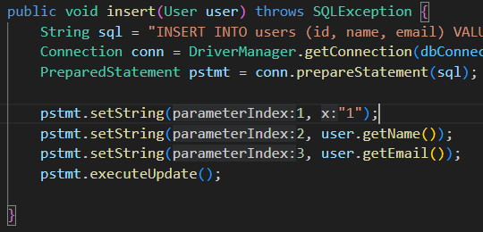
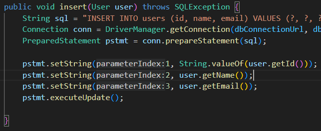
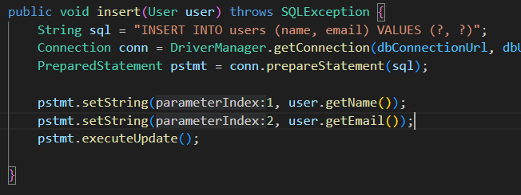

# Lab Report #5

## Part 1 - Debugging Scenario

This scenario is a made up lab where the students use some pre-done database
handling code and debug a few errors related to the insert method as well as
how several tests depend on each other in a circular fashion (bad practice
that I saw at work lol).

1. The original post may look something like this:


   > I'm having trouble understanding why I get a different error depending
   > on how many times I've run the tests. With an empty table and I run the
   > tests file, I get this error:
   
   

   > but when I re-run the tests without changing anything at all, I get this
   > error:
   
   
   > It looks like the first time I ran the test that `testInsert` succeeded
   > but the other two didn't because the entry wasn't there yet. The second
   > time I ran it, `testInsert` failed because of a duplicate entry or
   > something but somehow the other two tests didn't fail?

2. A response from a TA may look something like this:
   > Tests are usually asynchronous to speed up the process. So if you
   > tried to insert and check if
   > something was in the table at the same time, sometimes it might work, but
   > sometimes it might not on the first try. For the second error, look up
   > the contraints on primary keys in SQL.

3. From the response from the TA, the student may discover the bug in the
   insert method based on how primary keys must be unique. There's multiple
   ways to solve this: either let the server determine the id and you don't
   try and set it to anything, or let the user set it, but pass/parse it
   properly to the sql statement.


- The student may discover this bug in the program:

  


- These are two possible ways to fix the bug:

  


- or

  

4. File/Directory Structure of Assignment

- (root)
    - lib
        - hamcrest-core-1.3.jar
        - junit-4.13.2.jar
        - mysql-connector-j-8.2.0.jar
    - DBHandler.java
    - DBTests.java
    - test.sh
    - User.java

5. Contents of Each File Before Fixing Bug

DBHandler.java:

```java
import java.sql.Connection;
import java.sql.DriverManager;
import java.sql.PreparedStatement;
import java.sql.ResultSet;
import java.sql.SQLException;
import java.util.ArrayList;
import java.util.List;

public class DBHandler {
    private static final String dbHostname = "sql3.freemysqlhosting.net";
    private static final String dbPort = "3306";
    private static final String dbName = "sql3667242";
    private static final String dbUsername = "sql3667242";
    private static final String dbUserPassword = "1WM2lTgQpI";
    private static final String dbConnectionUrl = "jdbc:mysql://" + dbHostname + ":" + dbPort + "/" + dbName;

    public void insert(User user) throws SQLException {
        String sql = "INSERT INTO users (id, name, email) VALUES (?, ?, ?)";
        Connection conn = DriverManager.getConnection(dbConnectionUrl, dbUsername, dbUserPassword);
        PreparedStatement pstmt = conn.prepareStatement(sql);

        pstmt.setString(1, "1");
        pstmt.setString(2, user.getName());
        pstmt.setString(3, user.getEmail());
        pstmt.executeUpdate();

    }

    public List<User> findUserByName(String name) throws SQLException {
        String sql = "SELECT * FROM users WHERE name = ?";
        List<User> users = new ArrayList<>();
        Connection conn = DriverManager.getConnection(dbConnectionUrl, dbUsername, dbUserPassword);
        PreparedStatement pstmt = conn.prepareStatement(sql);

        pstmt.setString(1, name);
        try (ResultSet rs = pstmt.executeQuery()) {
            while (rs.next()) {
                users.add(new User(rs.getInt("id"), rs.getString("name"), rs.getString("email")));
            }
        }

        return users;
    }

    public User findUserByEmail(String email) throws SQLException {
        String sql = "SELECT * FROM users WHERE email = ?";
        User foundUser = null;
        Connection conn = DriverManager.getConnection(dbConnectionUrl, dbUsername, dbUserPassword);
        PreparedStatement pstmt = conn.prepareStatement(sql);

        pstmt.setString(1, email);
        try (ResultSet rs = pstmt.executeQuery()) {
            if (rs.next()) {
                foundUser = new User(rs.getInt("id"), rs.getString("name"), rs.getString("email"));
            }
        }

        return foundUser;
    }
}
```

DBTests.java:

```java
import static org.junit.Assert.*;
import org.junit.*;
import java.util.List;

public class DBTests {
    private DBHandler dbHandler;

    @Test
    public void testInsert() throws Exception {
        dbHandler = new DBHandler();
        User testUser = new User(0, "John Doe", "test@example.com");
        dbHandler.insert(testUser);

        // Assuming email is unique, this should retrieve the inserted user
        User retrievedUser = dbHandler.findUserByEmail("test@example.com");
        assertNotNull(retrievedUser.toString());
        assertEquals(testUser.getName(), retrievedUser.getName());
        assertEquals(testUser.getEmail(), retrievedUser.getEmail());
    }

    @Test
    public void testFindUserByName() throws Exception {
        dbHandler = new DBHandler();
        // Assuming a user with the name "John Doe" exists in your database
        List<User> users = dbHandler.findUserByName("John Doe");
        assertFalse(users.isEmpty());
    }

    @Test
    public void testFindUserByEmail() throws Exception {
        dbHandler = new DBHandler();
        // Assuming a user with the email "jane@example.com" exists in your database
        User user = dbHandler.findUserByEmail("test@example.com");
        assertNotNull(user);
        assertEquals("test@example.com", user.getEmail());
    }
}
```

test.sh:

```java
set -e
javac -cp ".;lib/hamcrest-core-1.3.jar;lib/junit-4.13.2.jar" *.java
java -cp ".;lib/hamcrest-core-1.3.jar;lib/junit-4.13.2.jar;lib/mysql-connector-j-8.2.0.jar" org.junit.runner.JUnitCore DBTests
```

User.java:

```java
public class User {
    private int id;
    private String name;
    private String email;

    // Constructor
    public User(int id, String name, String email) {
        this.id = id;
        this.name = name;
        this.email = email;
    }

    // Getters and Setters
    public int getId() {
        return id;
    }

    public void setId(int id) {
        this.id = id;
    }

    public String getName() {
        return name;
    }

    public void setName(String name) {
        this.name = name;
    }

    public String getEmail() {
        return email;
    }

    public void setEmail(String email) {
        this.email = email;
    }

    // Overriding toString for easy display
    @Override
    public String toString() {
        return "User{" +
                "id=" + id +
                ", name='" + name + '\'' +
                ", email='" + email + '\'' +
                '}';
    }
}
```

database.sql:

```sql
# Run this file once to create the table!
CREATE TABLE users (
    id INT PRIMARY KEY,
    name VARCHAR(100),
    email VARCHAR(100)
);
```

6. Commands to Trigger Bug:
   Running `bash test.sh` twice

7. Ways to Fix Bug:

- In the `insert()` method in DBHandler.java, we are erroneously setting the
  primary key manually to "1" every time we try and insert and entry instead of
  letting the SQL engine handle auto-incrementing it. This works the first
  time, when the table is empty, but stops working since there would be a
  duplicate primary key. We can either let the user set the primary key (bad
  idea) or better yet, remove it entirely so the SQL server sets it for us.

## Part 2 - Reflection

From week 5 on, I learned a ton of bash-related information like how to
write the conditionals properly and capture output into variables, xargs to
pass it into other commands, etc. I also never knew how to exit vim lol, so
learning how to use vim and the vimtutor were pretty cool. I've now used vim
at least once outside of class. I learned that Ctrl+` opens the terminal in
VSCode but actually I've always used IntelliJ IDEs, and so working in VSCode has
made me more comfortable using that too, and I'm starting to like it a lot more.